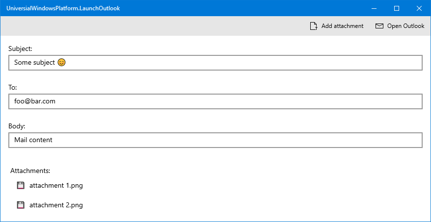

# Launch Outlook from a UWP app with attachments

This demo project demonstrates how to launch Outlook from a UWP application.

## Why?
UWP already comes with the possibility to open a mail dialog with the mail app of your choice. However - until this day - attachments will vanish if Outlook is selected as mail client.

## But how?
Outlook mails can be saved to *.msg files. Opening an *.msg file will launch the "new mail" window of outlook with subject, body text, recipients etc. already prefilled. Attachments can also be part of an *.msg file.

This demo creates such an *.msg file (using [MsgKit](https://github.com/Sicos1977/MsgKit)) inside of the local cache folder and will launch it from within the UWP app.

That's already all there is to it. 😅

## That sounds weird. Isn't there a better solution?
Usually Outlook can be opened using the `Microsoft.Office.Interop.Outlook` namespace. This, however, is not possible from within a UWP application as it runs inside a sandbox and is not allowed to communicate with other non-app programs.

The only workaround you can find online makes use of the [`FullTrustProcessLauncher`](https://stefanwick.com/2017/05/26/uwp-calling-office-interop-apis/). This solution, however, is a pain to implement and will also result in three different projects - only to launch an Outlook instance.

The solution I present is both simple to implement and will not affect the rest of your project.

## How does it look?

### The app

### The outlook instance
